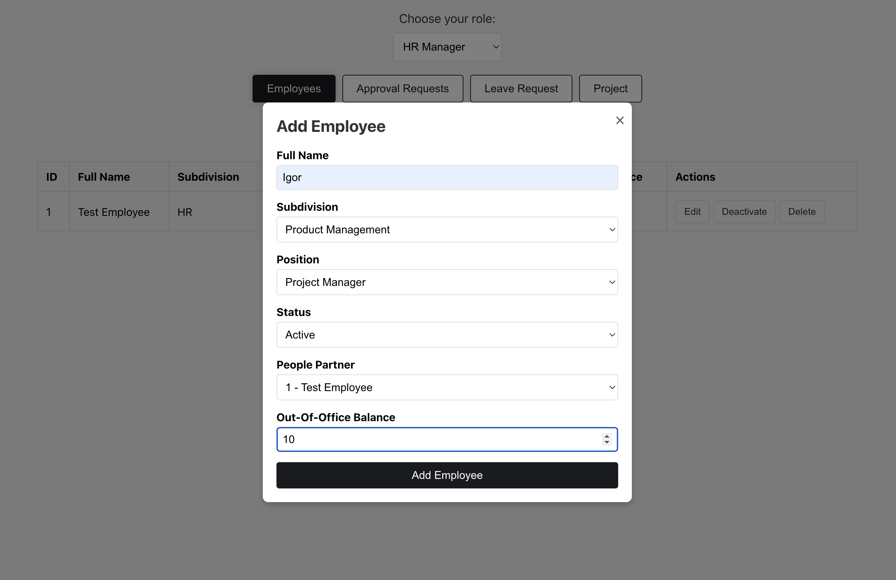
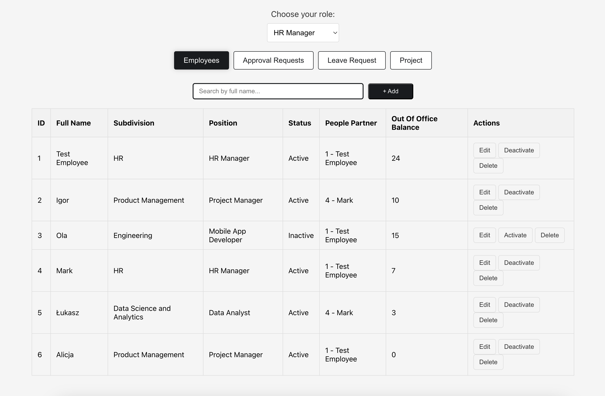
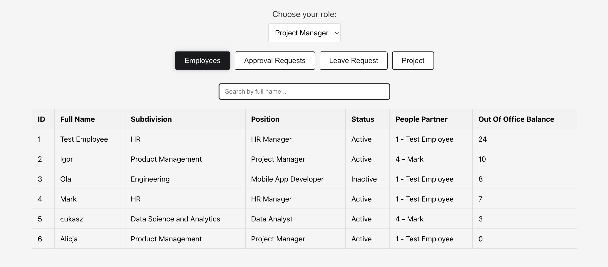
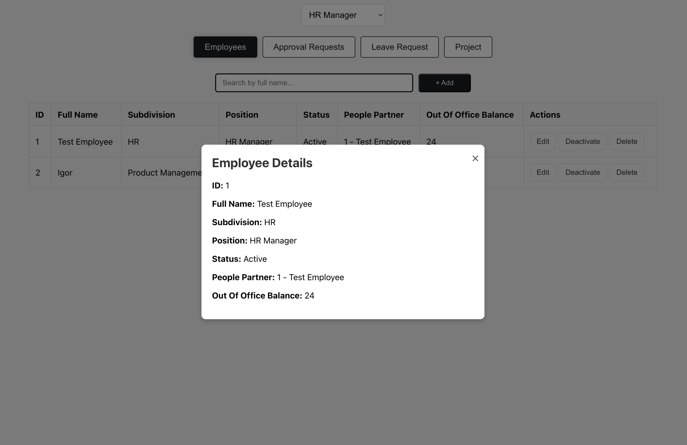
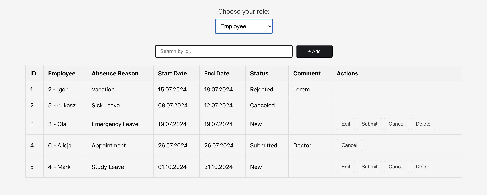
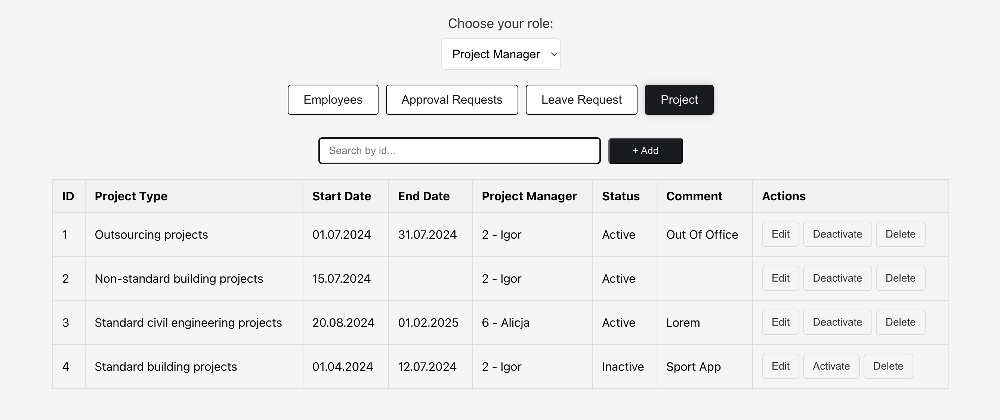
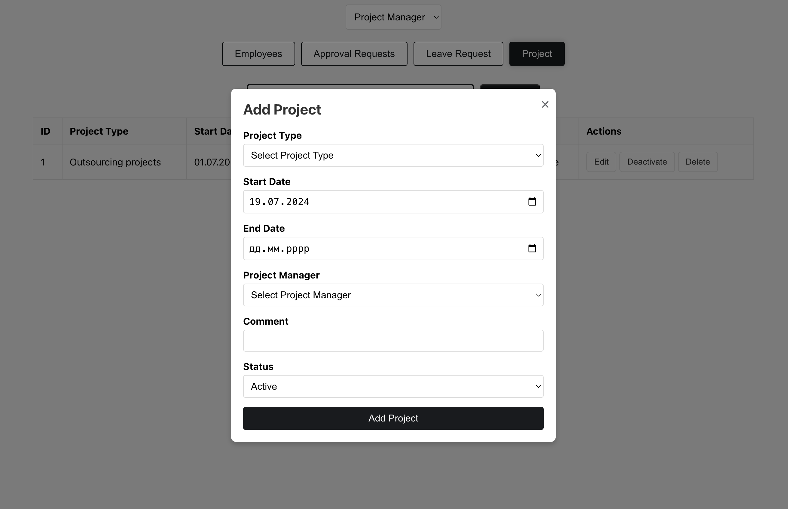
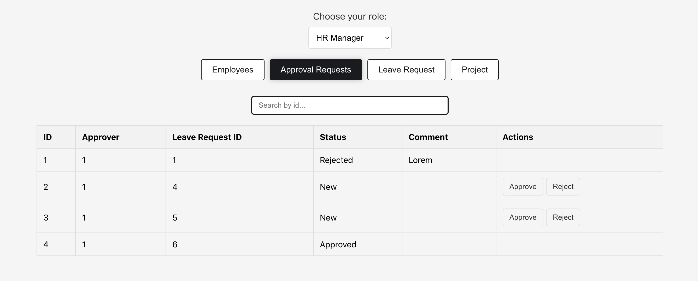
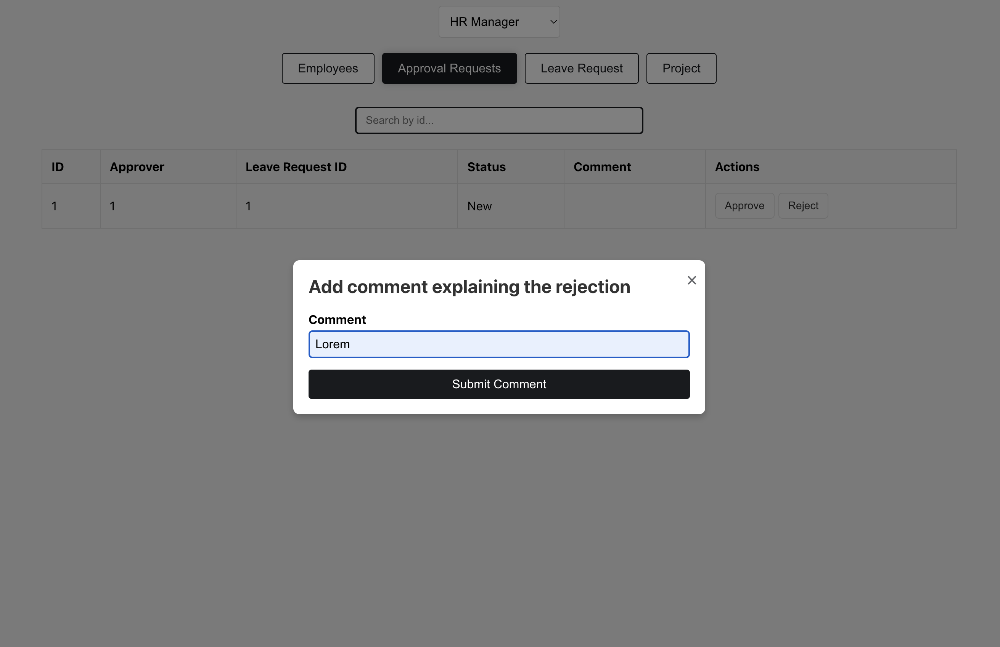
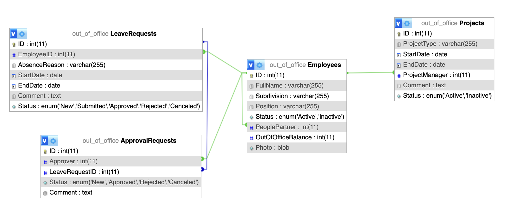

# Out Of Office Application

## Prerequisites

- [XAMPP](https://www.apachefriends.org/index.html)
- [MySQL](https://www.mysql.com/)
- [Node.js](https://nodejs.org/)

## Technologies Used

- React
- TypeScript
- SCSS

## Installation

1. **Clone the repository**

   ```bash
   git clone https://github.com/irinosochka/Out-Of-Office.git

2. **Navigate to the project directory**

   ```bash
   cd Out-Of-Office

3. **Install backend dependencies**

   ```bash
   cd BackEnd
   npm install

4. **Install frontend dependencies**

   ```bash
   cd ../FrontEnd
   npm install

## Running the Application

1. **Start the backend server**

   ```bash
   cd ../BackEnd
   npm start

2. **Start the frontend server**

   ```bash
   cd ../FrontEnd
   npm start

## Database Setup

- The database is created automatically when the backend server is started. 
- The Test Employee is automatically inserted into database after creation
- The database name is 'out_of_office'.
- If the database already exists, the program will not create a new one.

## Using the Application

- The server runs on port 8082.
- Open a browser and navigate to http://localhost:3000/.

Now you can start using the application in your browser.

#### Choose Role


#### Pop up Add Employee


#### Table Employees if your Role is HR Manager


#### Table Employees if Role is Project Manager


#### Pop up with info about Employee


#### Table Leave Requests if Role is Employee


#### Table Projects if Role is Project Manager


#### Pop up Add Project


#### Table Approval Requests 


#### Pop up to wrote comment


#### DB Schema



### SQL queries that were used to create the database

```bash
CREATE DATABASE out_of_office;

USE out_of_office;

CREATE TABLE Employees (
ID INT AUTO_INCREMENT PRIMARY KEY,
FullName VARCHAR(255) NOT NULL,
Subdivision VARCHAR(255) NOT NULL,
Position VARCHAR(255) NOT NULL,
Status ENUM('Active', 'Inactive') NOT NULL,
PeoplePartner INT NOT NULL,
OutOfOfficeBalance INT NOT NULL,
Photo BLOB,
FOREIGN KEY (PeoplePartner) REFERENCES Employees(ID)
);

CREATE TABLE LeaveRequests (
ID INT AUTO_INCREMENT PRIMARY KEY,
EmployeeID INT NOT NULL,
AbsenceReason VARCHAR(255) NOT NULL,
StartDate DATE NOT NULL,
EndDate DATE NOT NULL,
Comment TEXT,
Status ENUM('New', 'Submitted', 'Approved', 'Rejected', 'Canceled') NOT NULL,
FOREIGN KEY (EmployeeID) REFERENCES Employees(ID)
);

CREATE TABLE ApprovalRequests (
ID INT AUTO_INCREMENT PRIMARY KEY,
Approver INT,
LeaveRequestID INT,
Status ENUM('New', 'Approved', 'Rejected', 'Canceled') NOT NULL,
Comment TEXT,
FOREIGN KEY (Approver) REFERENCES Employees(ID),
FOREIGN KEY (LeaveRequestID) REFERENCES LeaveRequests(ID)
);

CREATE TABLE Projects (
ID INT AUTO_INCREMENT PRIMARY KEY,
ProjectType VARCHAR(255) NOT NULL,
StartDate DATE NOT NULL,
EndDate DATE,
ProjectManager INT,
Comment TEXT,
Status ENUM('Active', 'Inactive') NOT NULL,
FOREIGN KEY (ProjectManager) REFERENCES Employees(ID)
);

-- Insert Initial Employee Data
INSERT INTO Employees (FullName, Subdivision, Position, Status, PeoplePartner, OutOfOfficeBalance)
VALUES
('Test Employee', 'HR', 'HR Manager', 'Active', 1, 24);
